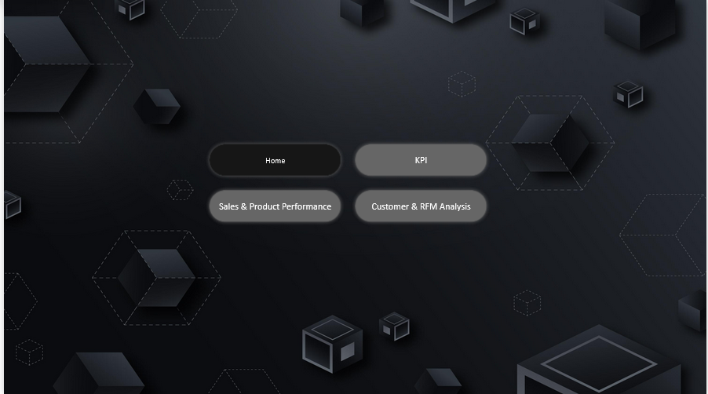
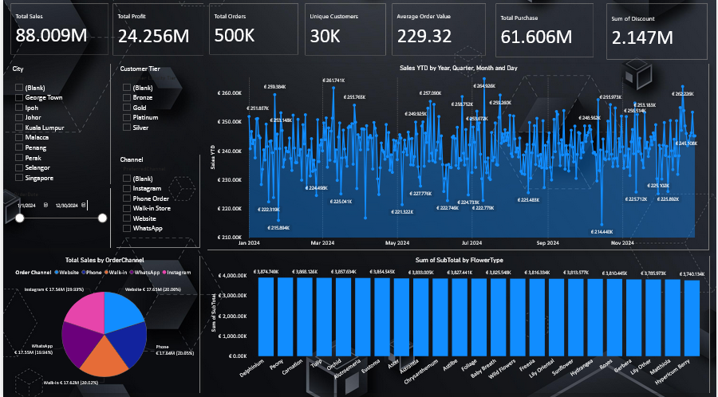
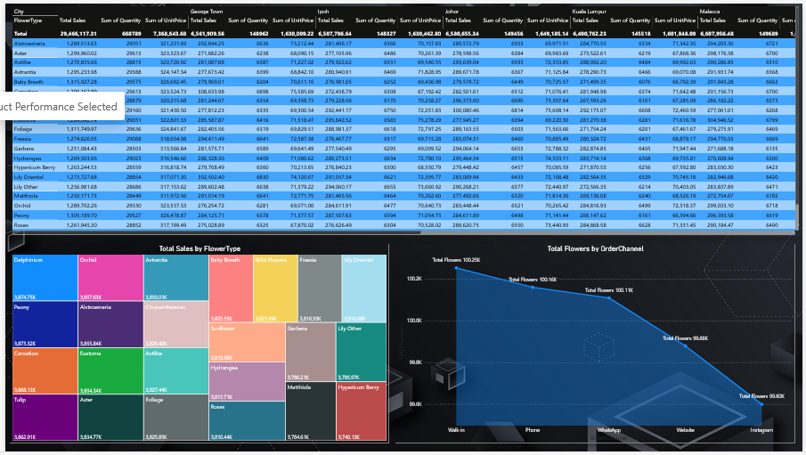
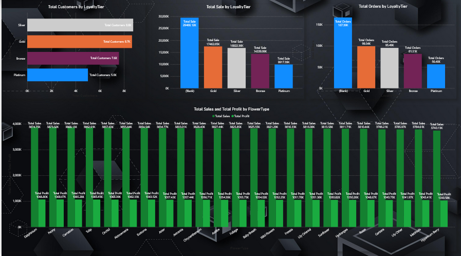

# Flower-Sales-Analytics-Customer-Intelligence-Platform
## Executive Summary
This project delivers an end-to-end analytics solution for a large-scale flower retail business inspired by europe flower market Using a 500K+ row transactional dataset, the solution models sales, customer behavior, seasonality, loyalty, promotions, and fraud signals in a star-schema optimized for Power BI, Tableau, and big-data tools.

The final output is a business-ready analytics model that enables executives to monitor revenue and profitability, marketing teams to evaluate campaigns and customer segments, and operations teams to detect anomalies and fraud. The solution emphasizes scalability, performance, and decision-driven insights.
## Business Problem
Flower retail businesses face multiple analytical challenges:

* Highly seasonal demand (Valentine’s Day, Mother’s Day, weddings)

* Multiple sales channels (online, WhatsApp, in-store)

* Complex customer behavior with repeat purchases and gifting

* Measuring marketing campaign effectiveness

* Identifying high-risk / fraudulent orders

* Lack of a unified customer lifetime value and loyalty view
The business needs a single analytical source of truth that supports:

### Executive KPI monitoring

* Customer segmentation (RFM & Loyalty)

* Product and channel performance

* Fraud detection and investigation

* Scalability to hundreds of thousands of transactions
## Methodology
### 1. Data Modeling
A **star schema** was designed for analytics performance and clarity:
### Fact Table

* fact_order_lines (~500K rows)

* One row per product per order

* Revenue, cost, discount, profit

* Fraud flag, campaign usage, order channel
### Dimension Tables

* dim_customers (RFM metrics, loyalty tiers)

* dim_products (flower types, categories)

* dim_calendar (date intelligence)

* dim_orders (order-level attributes)
### 2. Feature Engineering
* RFM scoring (Recency, Frequency, Monetary)

* Loyalty tier classification (Bronze → Platinum)

* Campaign and coupon usage flags

* Fraud simulation patterns (high discounts, payment reuse, abnormal frequency)

* Seasonal demand patterns injected into sales volume
### 3. BI & Analytics
* Power BI semantic model with optimized relationships

* Time intelligence (MTD, YTD, YoY)

* Customer segmentation and cohort analysis

* Fraud monitoring dashboards

* Executive KPI dashboards
### 4. Performance Optimization

* Star schema relationships (single-direction)

* Parquet format for big-data tools

* Incremental refresh strategy

* Pre-aggregated KPIs via DAX measures
## Skills & Technologies
### Analytics & BI

* Power BI (DAX, Data Modeling, RLS)

* Tableau (TWBX skeleton)

* KPI design & executive dashboards
### Data Engineering

* Star schema design

* Fact & dimension modeling

* Incremental refresh strategy

* Parquet for analytical workloads
### Programming & Tools

* Python (data generation, simulation)

* SQL (analytics logic)

* DAX (advanced measures)

* Power Query (M)

* GitHub (documentation & versioning)
### Business Analytics

* RFM & loyalty modeling

* Marketing campaign analysis

* Fraud pattern simulation

* Customer lifetime value concepts
## Results & Business Recommendations
### Key Insights Enabled

* Clear revenue and profit visibility by product, region, and channel

* Identification of high-value customers (Platinum / Gold tiers)

* Detection of unusual discount and payment behavior

* Understanding of seasonal spikes and demand planning

* Measurement of campaign ROI and coupon effectiveness
### Business Recommendations

* Prioritize Platinum & Gold customers with exclusive campaigns

* Increase inventory ahead of Valentine’s & Mother’s Day

* Introduce fraud alerts for high-discount + rapid repeat orders

* Optimize product pricing based on margin by flower type

* Shift marketing spend to high-converting channels
## Next Steps

* Integrate real transaction data via APIs or data warehouse

* Add machine-learning fraud detection models

* Implement customer lifetime value (CLV) forecasting

* Automate pipelines using Airflow / AWS / Azure

* Deploy row-level security (RLS) for regional managers

* Build real-time dashboards with streaming data

